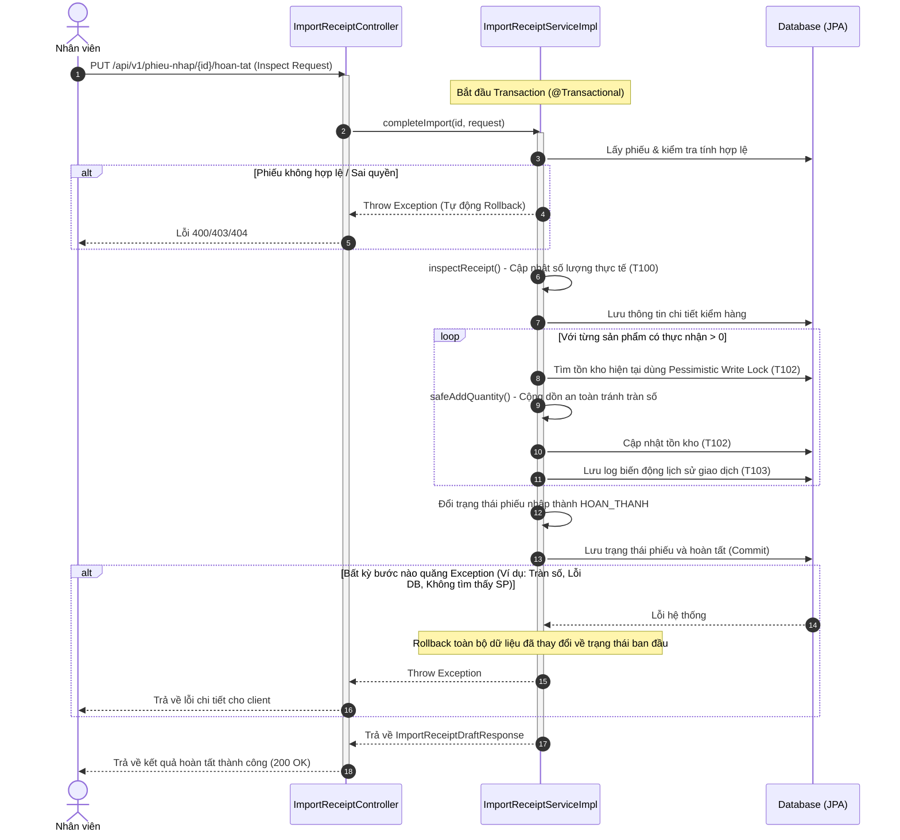

# T104 - Đảm Bảo Transaction Khi Hoàn Tất Nhập Kho

**Mục đích**: Thiết lập giao dịch an toàn (ACID) bằng cách bọc toàn bộ các khâu xử lý hoàn tất nhập kho (kiểm hàng -> tăng tồn kho -> ghi log giao dịch -> đổi trạng thái phiếu nhập) trong một Transaction duy nhất. Bất kỳ lỗi nào phát sinh ở bất kỳ khâu nào sẽ tự động rollback toàn bộ trạng thái trước đó của cơ sở dữ liệu.

---

## 1. Cơ Chế Nghiệp Vụ & Sơ Đồ Luồng (Transaction Flow)

### 1.1 Chi Tiết Luồng Xử Lý
1. **Lấy phiếu**: Truy vấn thông tin phiếu nhập kho và kiểm tra tính hợp lệ về trạng thái (`CHO_KIEM_HANG`) và quyền hạn của người thực hiện.
2. **Cập nhật kiểm hàng (T100)**: Thực hiện cập nhật số lượng thực tế kiểm đếm, tình trạng sản phẩm và đối chiếu chênh lệch giữa thực nhận và chứng từ.
3. **Tăng tồn kho (T102)**: Với từng dòng sản phẩm có số lượng thực nhận lớn hơn 0, tiến hành cộng dồn số lượng vào kho tương ứng bằng **Pessimistic Lock** (`SELECT ... FOR UPDATE`).
4. **Ghi log giao dịch (T103)**: Tự động ghi nhận lịch sử biến động số lượng trước và sau của sản phẩm tại kho hàng để đối soát.
5. **Đổi trạng thái**: Chuyển trạng thái phiếu nhập kho sang `HOAN_THANH` và lưu trữ thông tin người hoàn thành cùng thời gian thực tế.

### 1.2 Sơ Đồ Luồng Giao Dịch (Transaction Flow Diagram)



---

## 2. Thiết Kế Hệ Thống & Cấu Trúc File

### 2.1 Các File Mới Tạo & Cập Nhật

* **Controller**:
  * [ImportReceiptController.java](src/main/java/com/smartflow/smestocksensebackend/controller/ImportReceiptController.java): Tạo mới API `PUT /api/v1/phieu-nhap/{id}/hoan-tat`.
* **Config**:
  * [SecurityConfig.java](src/main/java/com/smartflow/smestocksensebackend/config/SecurityConfig.java): Cấu hình phân quyền cho API mới, chỉ cho phép vai trò `ADMIN` và `EMPLOYEE` thực hiện.
* **Service**:
  * [ImportReceiptService.java](src/main/java/com/smartflow/smestocksensebackend/service/ImportReceiptService.java): Định nghĩa signature hàm nghiệp vụ `completeImport()`.
  * [ImportReceiptServiceImpl.java](src/main/java/com/smartflow/smestocksensebackend/service/impl/ImportReceiptServiceImpl.java): Tích hợp `@Transactional(rollbackFor = Exception.class)` và triển khai gọi tuần tự 5 bước theo luồng nghiệp vụ.
* **Unit Test**:
  * [ImportReceiptCompleteServiceTest.java](src/test/java/com/smartflow/smestocksensebackend/service/impl/ImportReceiptCompleteServiceTest.java): Kiểm thử các kịch bản thành công và đặc biệt là kịch bản giả lập lỗi giữa chừng để đảm bảo Exception lan truyền kích hoạt rollback đúng.

---

## 3. Kiểm Thử Hệ Thống (Unit Tests)

### 3.1 Chạy Kiểm Thử Riêng Biến Động Hoàn Tất
Chạy riêng các test case cho Service Hoàn tất nhập kho:
```bash
./mvnw test -Dtest=ImportReceiptCompleteServiceTest
```

### 3.2 Chạy Toàn Bộ Test Suite
```bash
./mvnw test
```
