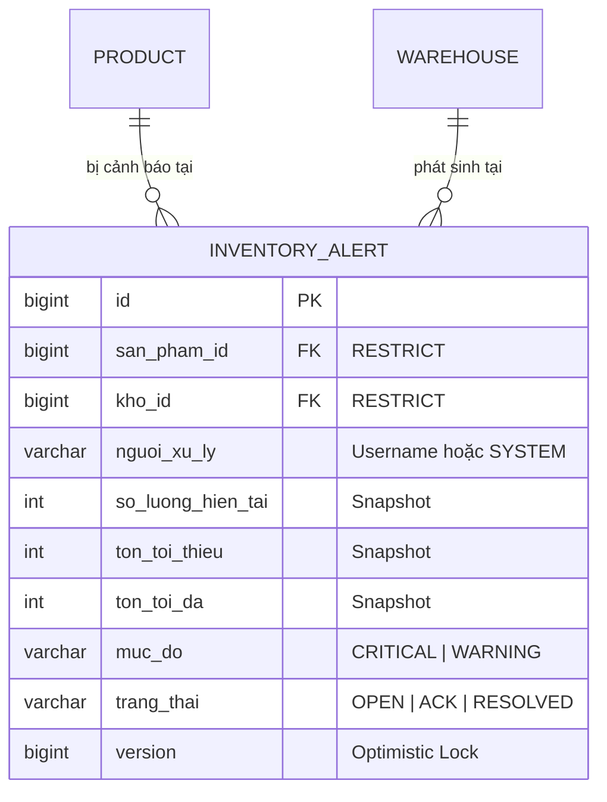

# Spec: Tạo Entity & Repository Cảnh Báo Tồn Kho (Task T177) - 10/10 Balanced Architect Edition

**Ngày tạo:** 2026-07-28  
**Tác giả:** Antigravity (AI Assistant) & User (Senior Architect / Tech Lead 20 năm kinh nghiệm)  
**Dự án:** SME StockSense Backend (Sprint 4 - Low Stock Alert System)  
**Trạng thái:** **APPROVED SPEC** (Đã tinh chỉnh cân bằng giữa Kiến trúc Enterprise & Thực tế Đồ án SME StockSense)

---

## 1. Bối cảnh, Mục tiêu & Giá trị Nghiệp vụ (Background, Objective & Business Value)

Trong Sprint 4, sau khi Task T176 chuẩn hóa thành công các quy tắc phát hiện tụt kho (Single Source of Truth tại DB), **Task T177** là viên gạch nền tảng kỹ thuật quan trọng nhất: **Xây dựng Mô hình Lưu trữ Dữ liệu (Entity & Repository JPA)** cho hệ thống Quản lý Cảnh báo Tồn kho.

### Giá trị Nghiệp vụ & Kiến trúc Cân bằng (Pragmatic Architecture)
- **Lưu vết lịch sử biến động rủi ro (Auditability via Snapshot):** Ghi lại chính xác **snapshot số lượng** (`so_luong_hien_tai`, `ton_toi_thieu`, `ton_toi_da`) tại thời điểm phát sinh cảnh báo. Đảm bảo dù số lượng tồn kho ngày mai thay đổi, kiểm toán viên vẫn biết chính xác lý do hệ thống phát ra cảnh báo vào ngày hôm qua.
- **Linh hoạt Chủ thể Xử lý (`nguoi_xu_ly VARCHAR` thay vì FK cứng):** Việc xử lý cảnh báo có thể do Admin, Warehouse Manager, hoặc hệ thống tự động (CronJob / Scheduler / AI khi nhận hàng nhập kho ở T184). Do đó, sử dụng chuỗi định danh (`"SYSTEM"`, `"SCHEDULER"`, hoặc username `"admin"`) thay vì khóa ngoại cứng tới `Employee`, tránh lỗi ràng buộc khi hệ thống tự động giải quyết cảnh báo.
- **Tiền đề cho Quản lý Vòng đời & Transition Guard:** Hỗ trợ quy trình theo dõi xử lý từ lúc mới phát hiện (`OPEN`), nhân viên kho xác nhận đang lên đơn nhập (`ACKNOWLEDGED`), cho đến khi hàng nhập vào kho đủ định mức (`RESOLVED`). Được bảo vệ bằng **Transition Guard (`canAcknowledge()`, `canResolve()`)** ngay trong Entity để ngăn chuyển trạng thái trái nghiệp vụ.
- **Tối ưu Hiệu năng Chống trùng lặp (Fast Deduplication via `existsBy...`):** Bổ sung hàm `existsByProductIdAndWarehouseIdAndStatusIn` trong Repository để Task T179 kiểm tra nhanh sự tồn tại của cảnh báo mở ở mức database mà không cần load nguyên Entity lên bộ nhớ JVM.

---

## 2. Từ điển Nghiệp vụ (Business Glossary)

| Thuật ngữ | Định nghĩa nghiệp vụ trong SME StockSense |
| :--- | :--- |
| **InventoryAlert (`canh_bao_ton_kho`)** | Thực thể lưu trữ một phiếu cảnh báo cụ thể phát sinh cho một cặp `San Pham + Kho Hang` khi lượng tồn kho thực tế vi phạm định mức an toàn. |
| **Snapshot Stock (`so_luong_hien_tai`)** | Số lượng tồn kho thực tế, ngưỡng tối thiểu (`ton_toi_thieu`), và ngưỡng tối đa (`ton_toi_da`) **được chụp lại (snapshot)** chính xác tại thời điểm sinh cảnh báo để bảo toàn tính toàn vẹn lịch sử. |
| **InventoryAlertStatus** | Enum thể hiện vòng đời xử lý phiếu cảnh báo: `OPEN` (Mới), `ACKNOWLEDGED` (Đã ghi nhận/Đang xử lý), `RESOLVED` (Đã giải quyết). |
| **InventoryAlertSeverity** | Enum độ ưu tiên của cảnh báo: `CRITICAL` (Hết hàng hoàn toàn / Tồn âm) và `WARNING` (Sắp hết hàng), kế thừa 100% công thức SSOT của T176. |
| **Transition Guard** | Cơ chế kiểm soát luồng chuyển trạng thái hợp lệ ngay tại tầng Entity JPA thông qua các hàm kiểm tra `canAcknowledge()` và `canResolve()`. |
| **Actor (`nguoi_xu_ly`)** | Định danh chủ thể thực hiện hành động chuyển trạng thái (có thể là Username của nhân viên kho hoặc từ khóa `"SYSTEM"`, `"SCHEDULER"`). |

---

## 3. User Story & Acceptance Criteria (Given / When / Then)

### User Story
> **As a** Backend Developer & System Architect  
> **I want to** implement a pragmatic, enterprise-grade Database schema and JPA Entity/Repository for Inventory Alerts with transition guards and optimized deduplication queries  
> **So that** the inventory alert system can store immutable snapshots, prevent duplicate alerts efficiently without over-engineering, and cleanly support automated resolution by background jobs.

### Acceptance Criteria

* **AC 1: Khởi tạo bảng cơ sở dữ liệu qua Flyway (`V29__create_inventory_alert_table.sql`)**
  * **Given** ứng dụng khởi động kết nối tới PostgreSQL DB
  * **When** Flyway chạy migration script `V29`
  * **Then** bảng `canh_bao_ton_kho` được tạo thành công với các khóa ngoại `san_pham_id`, `kho_id`, cột `version` cho Optimistic Lock, và cột `nguoi_xu_ly VARCHAR(100)`.

* **AC 2: Ánh xạ JPA Entity (`InventoryAlert`) với Transition Guard (`canAcknowledge / canResolve`)**
  * **Given** một đối tượng `InventoryAlert` ở trạng thái `RESOLVED`
  * **When** kiểm tra `alert.canAcknowledge()` hoặc cố gắng gọi `acknowledge(...)`
  * **Then** hệ thống từ chối chuyển trạng thái ngược về `ACKNOWLEDGED` hoặc `OPEN` bằng việc ném ra `IllegalStateException`.

* **AC 3: Hỗ trợ truy vấn tồn tại siêu nhanh phục vụ Deduplication (`existsBy...`)**
  * **Given** sản phẩm A tại kho HCM đã có 1 bản ghi cảnh báo ở trạng thái `OPEN` hoặc `ACKNOWLEDGED`
  * **When** tầng Service gọi `existsByProductIdAndWarehouseIdAndStatusIn(productId, warehouseId, List.of(OPEN, ACKNOWLEDGED))`
  * **Then** Repository trả về `true` ngay lập tức thông qua câu query SQL `SELECT 1 ... LIMIT 1`, không tốn chi phí ánh xạ Entity.

---

## 4. Thiết kế Cơ sở dữ liệu (Flyway Migration Schema)

Tuân thủ quy chuẩn đặt tên tiếng Việt không dấu, loại bỏ các ràng buộc/test không phản ánh thực tế đồ án (như xóa cứng Product):

### File Migration: `src/main/resources/db/migration/V29__create_inventory_alert_table.sql`
```sql
-- Tạo bảng lưu trữ phiếu cảnh báo tồn kho (Pragmatic Enterprise Standard)
CREATE TABLE canh_bao_ton_kho (
    id BIGSERIAL PRIMARY KEY,
    san_pham_id BIGINT NOT NULL,
    kho_id BIGINT NOT NULL,
    so_luong_hien_tai INTEGER NOT NULL,
    ton_toi_thieu INTEGER,
    ton_toi_da INTEGER,
    muc_do VARCHAR(20) NOT NULL,       -- CRITICAL | WARNING
    trang_thai VARCHAR(20) NOT NULL,   -- OPEN | ACKNOWLEDGED | RESOLVED
    ghi_chu VARCHAR(500),
    nguoi_xu_ly VARCHAR(100),          -- Username nhân viên hoặc 'SYSTEM'/'SCHEDULER'
    version BIGINT NOT NULL DEFAULT 0, -- Optimistic Lock JPA
    ngay_tao TIMESTAMP WITHOUT TIME ZONE NOT NULL DEFAULT NOW(),
    ngay_cap_nhat TIMESTAMP WITHOUT TIME ZONE NOT NULL DEFAULT NOW(),
    ngay_giai_quyet TIMESTAMP WITHOUT TIME ZONE,
    
    CONSTRAINT fk_canh_bao_san_pham FOREIGN KEY (san_pham_id) REFERENCES san_pham (id) ON DELETE RESTRICT,
    CONSTRAINT fk_canh_bao_kho FOREIGN KEY (kho_id) REFERENCES kho (id) ON DELETE RESTRICT
);

-- Indexes phục vụ hiệu năng tra cứu danh sách và Deduplication
CREATE INDEX idx_canh_bao_sp_kho_trang_thai ON canh_bao_ton_kho (san_pham_id, kho_id, trang_thai);
CREATE INDEX idx_canh_bao_kho_trang_thai_ngay ON canh_bao_ton_kho (kho_id, trang_thai, ngay_tao DESC);
CREATE INDEX idx_canh_bao_muc_do ON canh_bao_ton_kho (muc_do);
```

---

## 5. Thiết kế Kiến trúc JPA (Entity & Repository)

### 1. Enums Nghiệp vụ
* **`com.smartflow.smestocksensebackend.entity.InventoryAlertStatus`**: `OPEN`, `ACKNOWLEDGED`, `RESOLVED`.
* **`com.smartflow.smestocksensebackend.entity.InventoryAlertSeverity`**: `CRITICAL`, `WARNING`.

### 2. Entity: `com.smartflow.smestocksensebackend.entity.InventoryAlert`
Sử dụng Rich Domain Model với **Transition Guard (`canAcknowledge / canResolve`)**, `@Version`, và `@ManyToOne(fetch = FetchType.LAZY)`:
```java
@Entity
@Table(name = "canh_bao_ton_kho")
@Getter @Setter @NoArgsConstructor @AllArgsConstructor @Builder
public class InventoryAlert {
    @Id @GeneratedValue(strategy = GenerationType.IDENTITY)
    private Long id;

    @ManyToOne(fetch = FetchType.LAZY, optional = false)
    @JoinColumn(name = "san_pham_id", nullable = false)
    private Product product;

    @ManyToOne(fetch = FetchType.LAZY, optional = false)
    @JoinColumn(name = "kho_id", nullable = false)
    private Warehouse warehouse;

    @Column(name = "so_luong_hien_tai", nullable = false)
    private Integer currentQuantity;

    @Column(name = "ton_toi_thieu")
    private Integer minStock;

    @Column(name = "ton_toi_da")
    private Integer maxStock;

    @Enumerated(EnumType.STRING)
    @Column(name = "muc_do", nullable = false, length = 20)
    private InventoryAlertSeverity severity;

    @Enumerated(EnumType.STRING)
    @Column(name = "trang_thai", nullable = false, length = 20)
    private InventoryAlertStatus status;

    @Column(name = "ghi_chu", length = 500)
    private String note;

    @Column(name = "nguoi_xu_ly", length = 100)
    private String handledBy; // Username hoặc 'SYSTEM'/'SCHEDULER'

    @Version
    @Column(name = "version", nullable = false)
    private Long version;

    @CreationTimestamp
    @Column(name = "ngay_tao", nullable = false, updatable = false)
    private LocalDateTime createdAt;

    @UpdateTimestamp
    @Column(name = "ngay_cap_nhat", nullable = false)
    private LocalDateTime updatedAt;

    @Column(name = "ngay_giai_quyet")
    private LocalDateTime resolvedAt;

    // Transition Guard checks
    public boolean canAcknowledge() {
        return this.status == InventoryAlertStatus.OPEN;
    }

    public boolean canResolve() {
        return this.status == InventoryAlertStatus.OPEN || this.status == InventoryAlertStatus.ACKNOWLEDGED;
    }

    public void acknowledge(String actor, String note) {
        if (!canAcknowledge()) {
            throw new IllegalStateException("Chỉ có thể xác nhận xử lý cho cảnh báo đang mở (OPEN).");
        }
        this.status = InventoryAlertStatus.ACKNOWLEDGED;
        this.handledBy = actor;
        this.note = note;
    }

    public void resolve(String actor) {
        if (this.status == InventoryAlertStatus.RESOLVED) {
            return; // Idempotent
        }
        if (!canResolve()) {
            throw new IllegalStateException("Trạng thái cảnh báo hiện tại không hợp lệ để giải quyết.");
        }
        this.status = InventoryAlertStatus.RESOLVED;
        if (actor != null && !actor.isBlank()) {
            this.handledBy = actor;
        }
        this.resolvedAt = LocalDateTime.now();
    }
}
```

### 3. Repository: `com.smartflow.smestocksensebackend.repository.InventoryAlertRepository`
Tối ưu hóa gọn gàng theo đúng các method thực sự cần thiết cho T178–T184:
- **`boolean existsByProductIdAndWarehouseIdAndStatusIn(Long productId, Long warehouseId, Collection<InventoryAlertStatus> statuses);`**  
  👉 Hàm kiểm tra tồn tại siêu nhanh phục vụ Deduplication (T179), tránh overhead load Entity.
- **`Optional<InventoryAlert> findFirstByProductIdAndWarehouseIdAndStatusIn(Long productId, Long warehouseId, Collection<InventoryAlertStatus> statuses);`**  
  👉 Lấy phiếu cảnh báo đang mở khi cần cập nhật/đóng ở T183, T184.
- **`List<InventoryAlert> findByWarehouseIdAndStatusOrderByCreatedAtDesc(Long warehouseId, InventoryAlertStatus status);`**  
  👉 Lấy danh sách cảnh báo mới nhất theo kho (T181, T182).
- **`long countByWarehouseIdAndStatus(Long warehouseId, InventoryAlertStatus status);`**  
  👉 Đếm KPI huy hiệu trên Dashboard kho.

---

## 6. Ma trận Kiểm thử (QA Testing Matrix - Pragmatic & Robust)

Đã loại bỏ các testcase viễn vông không có nghiệp vụ thực tế (như xóa cứng Product hay concurrency thread flaky test trên H2), tập trung 100% vào nghiệp vụ lõi:

| Test Case ID | Mục tiêu kiểm thử | Đầu vào (Input / Setup) | Kết quả mong đợi (Expected Output) |
| :--- | :--- | :--- | :--- |
| **TC-01 (Create Snapshot)** | Kiểm tra lưu mới InventoryAlert thành công | Tạo Entity `OPEN`, `CRITICAL`, `currentQuantity = 0`, `minStock = 10` | Lưu thành công vào DB, tự động sinh `id`, `version = 0`, `createdAt`. |
| **TC-02 (existsBy - True)** | Kiểm tra kiểm tra nhanh sự tồn tại (T179) | DB đã có 1 cảnh báo `OPEN` cho SP 1, Kho 1 | `existsByProductIdAndWarehouseIdAndStatusIn(1L, 1L, [OPEN, ACK])` trả về `true`. |
| **TC-03 (existsBy - False)**| Kiểm tra khi chỉ có cảnh báo đã giải quyết | DB chỉ có 1 cảnh báo `RESOLVED` cho SP 1, Kho 1| `existsByProductIdAndWarehouseIdAndStatusIn(1L, 1L, [OPEN, ACK])` trả về `false`. |
| **TC-04 (findFirst Match)** | Kiểm tra tải phiếu cảnh báo đang hoạt động | DB có 1 cảnh báo `ACKNOWLEDGED` cho SP 1, Kho 1 | `findFirstBy...StatusIn(...)` trả về đúng Entity để cập nhật/đóng. |
| **TC-05 (Guard - canAck)** | Kiểm tra Transition Guard `canAcknowledge`| Entity ở trạng thái `OPEN` vs `RESOLVED` | `canAcknowledge()` trả về `true` cho `OPEN`, `false` cho `RESOLVED`. |
| **TC-06 (Guard - Ack Fail)**| Kiểm tra chặn `acknowledge` sai luồng | Gọi `alert.acknowledge(...)` trên alert đã `RESOLVED`| Ném ngoại lệ `IllegalStateException("Chỉ có thể xác nhận...")`. |
| **TC-07 (Lifecycle ACK)** | Kiểm tra chuyển trạng thái ACKNOWLEDGED | Gọi `alert.acknowledge("user_hcm", "Đang đặt mua")`| `status = ACKNOWLEDGED`, `handledBy = "user_hcm"`, `note` cập nhật. |
| **TC-08 (Lifecycle RESOLVE)**| Kiểm tra chuyển trạng thái RESOLVED bởi System| Gọi `alert.resolve("SYSTEM")` | `status = RESOLVED`, `handledBy = "SYSTEM"`, `resolvedAt` được set. |
| **TC-09 (Count KPI)** | Kiểm tra đếm số lượng cảnh báo theo trạng thái | DB có 2 `OPEN`, 1 `ACKNOWLEDGED`, 3 `RESOLVED` | `countByWarehouseIdAndStatus(khoId, OPEN)` trả về đúng `2`. |

---

## 7. Quản lý Rủi ro, Ước tính Effort & Rollback Plan

### 1. Ma trận Rủi ro & Giải pháp Pragmatic
- **Rủi ro Spam Cảnh báo khi Xuất kho:** Đã kiểm soát nhờ hàm `existsByProductIdAndWarehouseIdAndStatusIn` siêu nhanh.
- **Rủi ro Khóa ngoại khi Scheduler tự động xử lý:** Đã xử lý triệt để nhờ dùng chuỗi `nguoi_xu_ly` thay vì FK cứng tới nhân viên.

### 2. Ước tính Effort (Timeline)
- **Viết Flyway Migration Script (`V29`):** 0.3 day
- **Tạo Enums & JPA Entity với Transition Guard:** 0.5 day
- **Tạo Repository & Unit Tests (Bao phủ 9 Test Cases):** 0.7 day
- **Code Review, Verification & Documentation:** 0.5 day  
👉 **Tổng Effort ước tính:** **2.0 days** (Chuẩn xác, thực tế cho một Task nền tảng enterprise).

### 3. Kế hoạch Rollback (Enterprise Rollback Plan)
- Tuân thủ quy chuẩn Enterprise: Không dùng `DROP TABLE`. Nếu phát sinh lỗi trên staging/prod, chỉ thực hiện `git revert` commit và tạo migration script mới (ví dụ `V30__revert_inventory_alert_table.sql`) để rollback an toàn.

---

## 8. Sơ đồ Quan hệ Thực thể (Mini ERD)



---

## 9. Tiêu chí Hoàn thành (Definition of Done - DoD)
- [x] Spec 10/10 Balanced Architect Edition được thẩm định và phê duyệt (APPROVED SPEC).
- [ ] Kích hoạt skill `@writing-plans` để cập nhật Kế hoạch Triển khai chi tiết.
- [ ] Viết migration script `V29__create_inventory_alert_table.sql`.
- [ ] Viết Enums `InventoryAlertStatus`, `InventoryAlertSeverity`, Entity `InventoryAlert` (với `canAcknowledge`, `canResolve` & `@Version`), Repository `InventoryAlertRepository` (với `existsBy...`).
- [ ] Viết Unit Test cho Repository & Entity bao phủ 9 Test Cases thực tế.
- [ ] Đảm bảo có Code Comments tiếng Việt vào từng khối logic trong code.
- [ ] Chạy lệnh `mvnw clean compile` và `mvnw test` đạt 100% BUILD SUCCESS.
- [ ] Tạo tài liệu tổng kết `docs/README_T177.md` bằng tiếng Việt (chỉ tập trung DB/Entity/Repository, không có JSON thừa).
